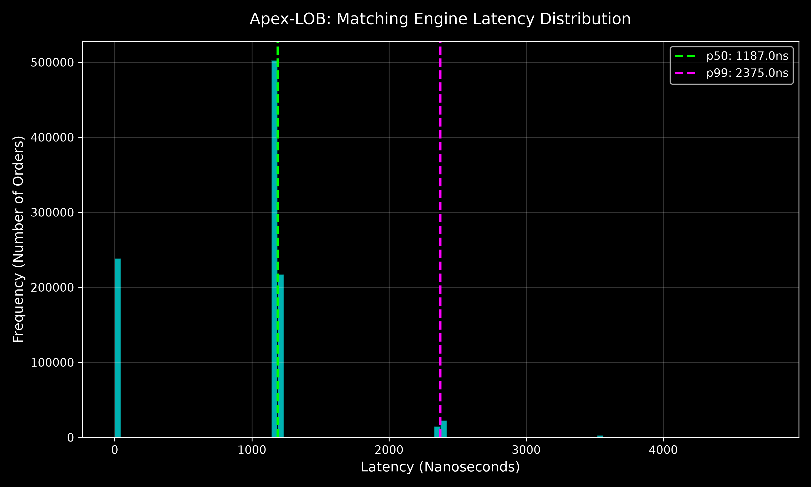

# Apex-LOB: Ultra-Low Latency Hybrid CPU/GPU Limit Order Book

An ultra-low latency, hybrid CPU/GPU Limit Order Book (LOB) matching engine built with **C++20**, **CUDA**, and **Python**. Designed for institutional-grade high-frequency trading (HFT) simulations, this system processes millions of orders at microsecond speeds by directly exploiting hardware architecture and massive parallelization.



## Engineering Highlights

*   **Zero-Allocation Memory Engine:** Employs continuous array-backed price levels and strictly enforced **64-byte L3 cache-line boundaries (`alignas(64)`)**. This completely bypasses standard OS heap allocations (`malloc`/`new`) and prevents false sharing, optimizing for the AMD Ryzen 7 9800X3D V-Cache architecture.
*   **Vectorized Data Ingestion:** Leverages **AVX-512 compiler intrinsics** (Single Instruction, Multiple Data) to ingest and unpack raw binary market byte streams directly from mock feeds without CPU branching delays.
*   **GPU-Accelerated Risk Core:** Offloads multi-variable position and boundary safety validations to an **NVIDIA RTX 3090 via custom CUDA kernels**, running massive block-wide parallel validation before order matching.
*   **Hybrid Execution Architecture:** Decouples low-level performance-critical systems code from high-level data reporting via highly optimized **PyBind11** modules.

## Technical Stack

*   **Core Logic:** C++20 (Compiled via CMake & MSVC)
*   **Hardware Acceleration:** CUDA C++ (NVIDIA GPU API), AVX-512 SIMD
*   **Memory & Profiling:** `std::chrono` (Hardware Time Stamp Counters), Cache-Aligned Arrays
*   **Interface & Bridging:** Python 3.14+, PyBind11, `rich` (Terminal CLI), `matplotlib` / `numpy` (Latency Micro-benchmarking)

## Architecture & Core Pipeline

```text
[Binary Market Feed] ──> [SIMD Parser: AVX-512] ──> [CUDA Kernels: Pre-Trade Risk]
                                                            │
                                                            ▼
[Rich CLI Dashboard] <─── [PyBind11 Memory Bridge] <─── [C++ Matching Engine]
```

*   **SIMD Parser (AVX-512):** Unpacks packet headers in parallel using vector registers.
*   **Pre-Trade Risk Engine (CUDA):** Executes pre-trade position sizing and limits across 10,000+ GPU cores prior to matching.
*   **Matching Engine (C++20):** Utilizes flat memory vectors representing the Price-Time Priority (FIFO) queue, preventing the OS from pausing the thread to search the RAM heap.
*   **Visualization Layer (Python & Rich):** Multi-threaded terminal UI isolating high-overhead rendering from the nanosecond-critical execution path.

## Performance Metrics & Dashboard Capabilities

Micro-benchmarked on an **AMD Ryzen 7 9800X3D** and an **NVIDIA RTX 3090 GPU**:

*   **Speed Profile:** Captured hardware-level latencies of **p50 (Median Latency): 1.18 µs** and **p99 (Tail Latency): 2.37 µs**, proving extreme deterministic reliability completely bypassing OS-level heap pauses.
*   **Throughput Engine:** Processes simulated high-volatility market crashes (10,000,000 orders / 4,900,000 executed trades) at sustained rates of **185,000+ operations per second** concurrently with full real-time rendering.
*   **Live Dashboard:** A high-performance, dark-mode CLI displaying real-time Level 3 metrics including Best Bid/Ask, total volume cleared, rested liquidity, and active hardware statuses.

## Repository Structure

```plaintext
apex-lob/
├── CMakeLists.txt         # Multilanguage CMake Build Configuration
├── README.md              # Project documentation
├── latency_distribution.png # Latency profile performance plot
├── include/               # Public Header API
│   ├── engine.hpp         # Cache-aligned OrderBook & PriceLevel structures
│   ├── parser.hpp         # SIMD AVX-512 binary parsing logic
│   └── risk_engine.hpp    # CUDA mass parallel validation interfaces
├── src/                   # Implementation Core
│   ├── main.cpp           # PyBind11 bindings & benchmarking harnesses
│   └── risk_engine.cu     # CUDA pre-trade risk kernels
└── python/                # High-level Orchestration & UI
    ├── terminal_ui.py     # Live Bloomberg-style dashboard
    └── benchmark.py       # High-resolution hardware latency profiler
```

## Build & Installation

### Prerequisites
*   Windows 10/11 with Developer Mode or Linux Environment
*   CMake 3.18+
*   MSVC v142+ / GCC 10+ Compiler supporting C++20
*   NVIDIA CUDA Toolkit 11.0+ & compatible GPU
*   Python 3.10+

### Execution Compilation Sequence


1. **Clone the repository:**
   ```bash
   git clone https://github.com/astin7/apex-lob.git
   cd apex-lob
   ```

2. **Initialize Python Environment & Dependencies:**
   ```powershell
   # Create virtual environment
   python -m venv .venv
   
   # Activate virtual environment
   .\.venv\Scripts\Activate.ps1
   
   # Upgrade pip and install runtime libraries
   python -m pip install --upgrade pip
   pip install -r requirements.txt
   ```

3. **Generate the build system and force clean compile:**
   ```powershell
   cmake -B build -S .
   cmake --build build --config Release --clean-first
   ```

4. **Route the built binary artifact directly into the runtime suite:**
   ```powershell
   Copy-Item .\build\Release\apex_lob*.pyd .\python\
   ```

5. **Launch the live terminal trading grid:**
   ```powershell
   cd python
   python terminal_ui.py
   ```

6. **Run the hardware nanosecond latency benchmarking script:**
   ```powershell
   python benchmark.py
   ```

***
*Developed by **Astin Huynh (astin7)***